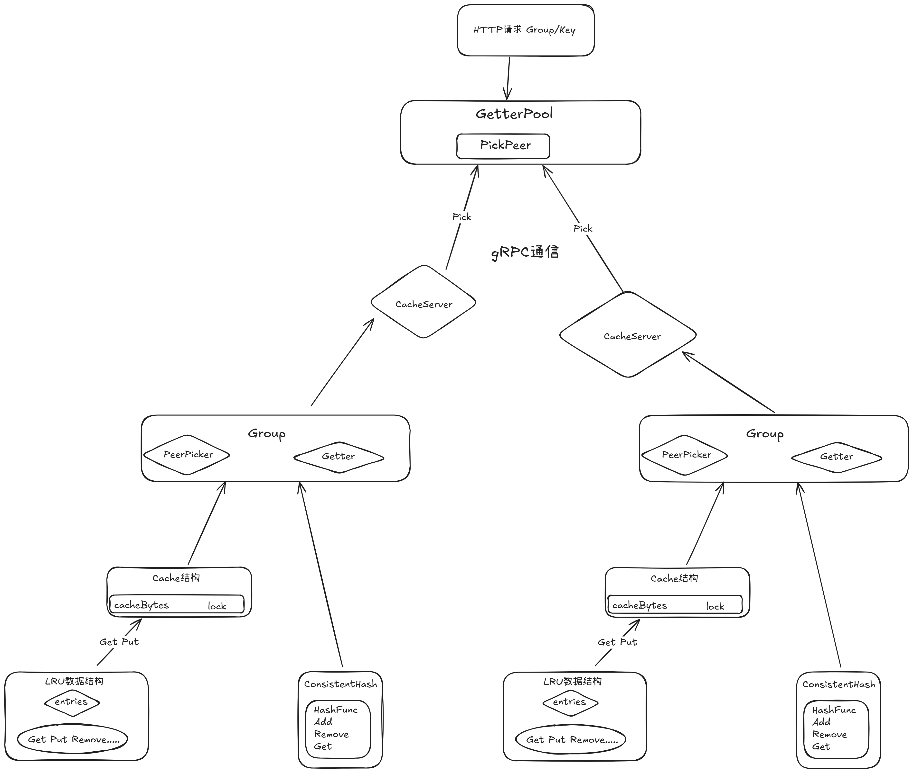

# RigoCache
 跟着7days-golang系列写的小玩具，RigoCache是一个分布式缓存系统
- 本来还想要把之前Singleflight给加进去，但是感觉意义不太大了，索性就结束了
- 一天搞定七天系列哈哈，在这里说一下踩的坑，和学到的东西

### 坑

- 极客兔兔的在第五天里讲的分布式，实际上每个节点都是通过HTTP通信，并且暴露给用户的接口不仅是http请求的入口，也是一个缓存服务器，byd，这里我一直没想明白
- 还有这个问题其实也是基于上面那个问题没有想明白犯的，当用户发送http请求的时候，会先从本地查找，然后去选择其他节点并查找，这个时候，由于其他缓存节点的接口依旧是本地查询key的那个Get方法，所以说会陷入无限循环~这里真是受不了了
- 所以我感觉这里最好是将缓存节点和http接口分开来是最好的，http接口负责接受请求，并且利用哈希环去查找相应的节点，然后向对应的接口发送请求，在遇到坑的时候，我才去仔细地看，发现封装的层级是真多，对于不熟悉这方面的人来说简直就是灾难，还有方法的命名也有很多重复的，导致我看的时候不知道谁是谁，看了好半天才区分出来，但是总的来说，还算很好的学习经历，值得一学。

### 学

- 一致性哈希，最开始我并不知道这个概念，仅仅是听说过，知道他是怎么用的了，姑且也算一个负载均衡策略吧。
- LRU缓存，之前接触也仅仅是看ostep和写算法题的时候接触过，但是上手实践，亲自用它去实现一个缓存还是第一次。
- 这次写了，也将之前的http间通信拓展成完全rpc了，过程中也算对分布式有了一点理解吧

感觉封装的层数有点多，画个图理清一下

